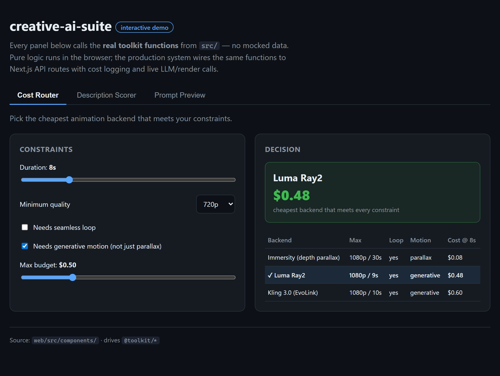
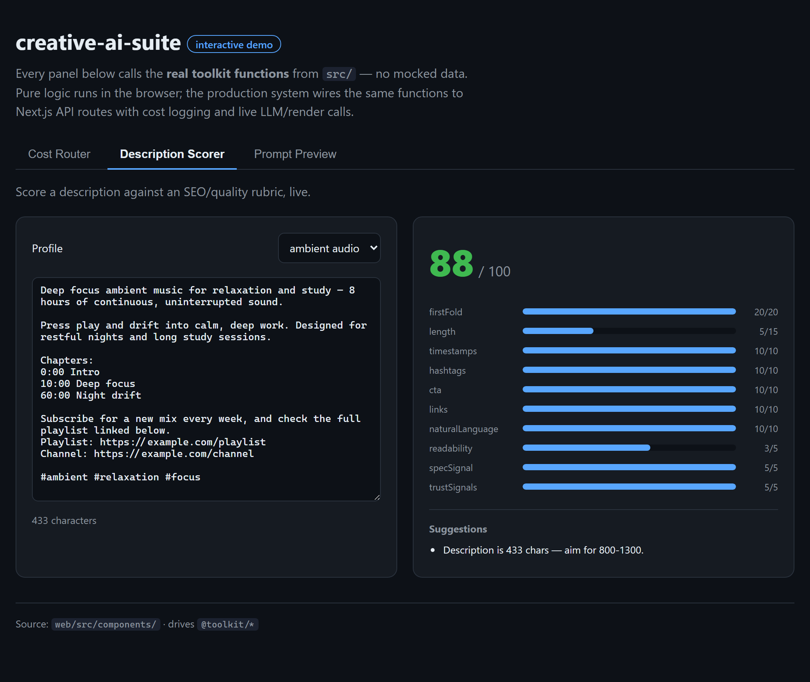
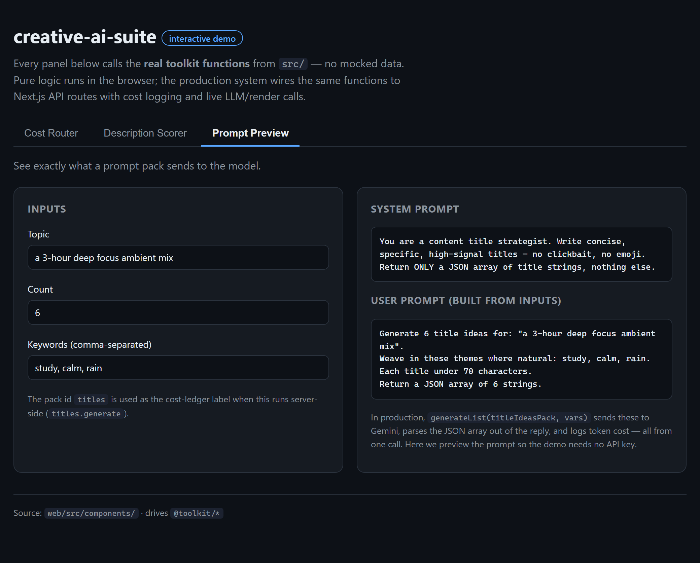

# creative-ai-suite

[](https://github.com/bburgess42/creative-ai-suite/actions/workflows/ci.yml)

A cost-aware, multi-provider toolkit for **AI-assisted creative content production** — text, image, video, and voice — with first-class spend observability and a durable job runner.

> **Code sample / portfolio.** This repository is a sanitized extract of the AI engineering layer from a production content-automation system I built and run. It is published for evaluation only — see [License](#license).

---

## Why this exists

Wiring an app to one AI API is easy. Running a *production* content pipeline across half a dozen of them — Gemini for text, Imagen for images, Kling/Luma for video, ElevenLabs for voice — surfaces the problems that actually matter in practice:

1. **Spend is invisible until the bill arrives.** Every paid call here routes through one ledger, tagged by feature, so cost is attributable and auditable after the fact.
2. **Providers have wildly different economics.** The same 10-second animation costs `$0.10` on one backend and `$0.75` on another, with different quality and capability tradeoffs. Features should declare *what they need* and let a router pick the cheapest backend that qualifies — not hard-code a vendor.
3. **Generation work outlives the request.** A multi-minute render must survive a dev-server hot-reload or a process restart. Jobs are tracked in a durable store with a real state machine and crash recovery.
4. **Prompts and domain knowledge should be data, not code.** Prompt templates are reusable "packs"; the content scorer's niche vocabulary is an injectable profile.

The emphasis throughout is the unglamorous production stuff — **observability, cost control, failure handling, testability** — not just calling a model.

There's also an **interactive demo UI** ([`web/`](web/)) — a React 19 + TypeScript app that drives the real toolkit functions in the browser (cost router, scorer, prompt builder) with zero config and no API keys. `cd web && npm install && npm run dev`.



> The Cost Router panel: move the constraints and `selectBackend()` picks the cheapest qualifying backend live. [More panels below.](#demo-ui)

## Architecture

```
                      ┌────────────────────────────────────────────┐
                      │                  src/                       │
                      ├────────────────────────────────────────────┤
  text features  ───▶ │  llm/      gemini client + prompt packs     │
                      │            + generic list-generation runner │──┐
  media features ───▶ │  media/    cost-aware animation router      │  │
                      │  scoring/  config-driven description scorer │  │
  long jobs      ───▶ │  jobs/     durable job store + detached     │  │
                      │            process spawner                  │  │
                      └────────────────────────────────────────────┘  │
                                          │  every paid call           │
                                          ▼                            │
                      ┌────────────────────────────────────────────┐  │
                      │  cost/  pricing tables + shared JSON ledger │◀─┘
                      └────────────────────────────────────────────┘
                                          ▲
                      python/  CLI scripts (image gen, TTS) write to the
                               SAME ledger — one source of truth, two runtimes
```

### Modules

| Module | What it does | Highlights |
|---|---|---|
| `src/cost/` | Pricing tables + append-only JSON cost ledger | One blended rate per entry; `logGeminiUsage` folds thinking-tokens into output; `rollup()` for dashboards |
| `src/llm/` | Gemini client with auto-logging, prompt packs, list-generation runner | Handles Gemini 2.5 "thinking" parts; forgiving JSON-or-lines parsing shared across every "give me N options" feature |
| `src/media/` | Cost-aware animation backend selection | Declarative constraints (duration, quality floor, loop, generative motion, budget) → cheapest qualifying backend, with per-backend rejection reasons |
| `src/scoring/` | Heuristic SEO/quality scorer for descriptions | 100-point rubric; niche vocabulary lifted into an injectable `ScoringProfile` |
| `src/jobs/` | Durable job store + detached process spawner | `queued → running → complete/error` state machine; orphan sweep; processes survive dev-server reloads |
| `python/` | CLI counterparts (Imagen generation, ElevenLabs TTS) | Both log spend to the same ledger format the TypeScript side uses |

## Quick start

```bash
npm install
npm test          # vitest — 29 unit tests (pricing, ledger, router, scorer, jobs, parsing)
npm run typecheck # tsc --noEmit, strict mode
npm run build     # emit dist/ (JS + .d.ts) — what the import examples below resolve to
```

The Python ledger has its own tests: `cd python && python -m unittest discover -p "test_*.py"`.

To run anything that hits a real API, copy `.env.example` to `.env` and fill in your keys.

### Using it

After `npm run build`, the package resolves by name via its `exports` map (it's
`private`, so the name is illustrative rather than published — link it or import
from `./dist`). The tests and demo UI import straight from source instead.

```ts
import { generateList, titleIdeasPack } from "creative-ai-suite";

// LLM list generation with cost auto-logged under "titles.generate"
const titles = await generateList(titleIdeasPack, {
  topic: "a 3-hour deep focus ambient mix",
  count: 6,
  keywords: ["study", "calm"],
});

import { selectBackend } from "creative-ai-suite";

// Pick the cheapest backend that can do a looping, generative 8s clip under $0.50
const choice = selectBackend({
  durationSec: 8,
  needsLoop: true,
  needsGenerativeMotion: true,
  maxBudget: 0.5,
});
// → { backend: "luma", estimatedCost: 0.48, ... }  (or a failure with reasons)
```

## Design notes

- **Cost logging never throws.** A failed ledger write is logged and swallowed — observability must not take down the feature it observes.
- **Storage is inverted.** `jobs/` depends on a `JobStore` *interface*, not a database. The shipped `InMemoryJobStore` runs the tests; production swaps in a SQLite-backed implementation of the same contract.
- **The detached-spawn pattern came from a real incident** — a long upload was killed at ~70% when the dev server hot-reloaded and SIGTERM propagated to the child. The fix (own process group + `unref()` + pidfile + durable row) is documented inline in `src/jobs/spawn.ts`.
- **Strict TypeScript** (`strict`, `noUnusedLocals`, `noUnusedParameters`) and pure-function cores keep the logic testable without mocking the network.

See [`docs/ARCHITECTURE.md`](docs/ARCHITECTURE.md) for the ledger schema, the backend-selection algorithm, and the job lifecycle in detail.

## Demo UI

A zero-config React 19 + TypeScript app ([`web/`](web/)) whose panels call the
real toolkit functions in the browser — no mocked data, no API keys. Run it with
`cd web && npm install && npm run dev`.

**Description Scorer** — live 0–100 grading with a per-criterion breakdown and suggestions:



**Prompt Preview** — see exactly what a prompt pack sends to the model:



## Project layout

```
src/
  cost/      pricing.ts, cost-logger.ts
  llm/       gemini.ts, prompt-pack.ts, generate.ts
  media/     animation-router.ts
  scoring/   content-scorer.ts, profiles.ts
  jobs/      job-store.ts, spawn.ts
  index.ts
tests/       vitest unit tests (one per module)
web/         interactive demo UI (Vite + React 19), drives @toolkit live
python/      generate_image.py, tts_narration.py, cost_tracker.py
docs/        ARCHITECTURE.md
```

## About

I'm **Brent Burgess** — I build AI-assisted production systems end to end, from
the model-integration and cost/observability layer up through the React UI that
drives it.

This repository is a sanitized slice of a content-automation platform I designed,
built, and **operate solo in production**. It orchestrates several generative-AI
providers (text, image, video, voice) behind one cost-aware, observable layer,
with a durable job runner and a React front end. I extracted the parts that best
show how I approach real systems — attributable spend, provider tradeoffs,
failure handling, and testable code — rather than a from-scratch toy. Built with
TypeScript, React, Node, and Python.

Happy to walk through any part of the design.

- **GitHub:** [@bburgess42](https://github.com/bburgess42)
- **LinkedIn:** [brent-burgess](https://www.linkedin.com/in/brent-burgess-126984a/)
- **Email:** burgess.brent@gmail.com

## License

Copyright © 2026 Brent Burgess. **All rights reserved.** Published publicly as a
portfolio / code sample for evaluation by prospective employers and
collaborators. You may read, clone, and run it to evaluate the work; you may
**not** use, copy, modify, redistribute, or sell it (in whole or in part)
without prior written permission. Full terms in [LICENSE](LICENSE).
